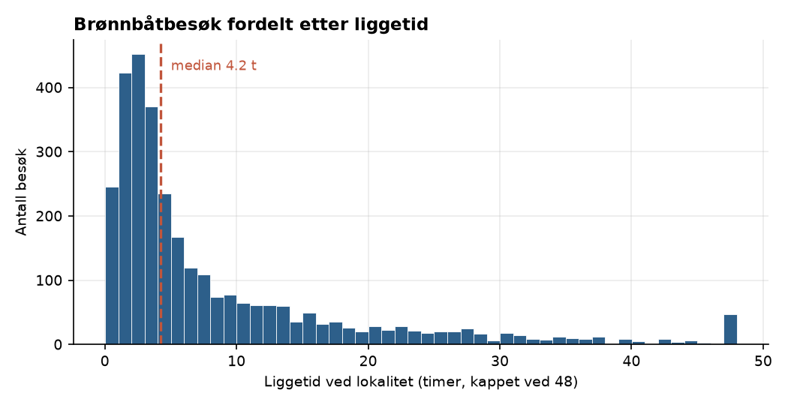
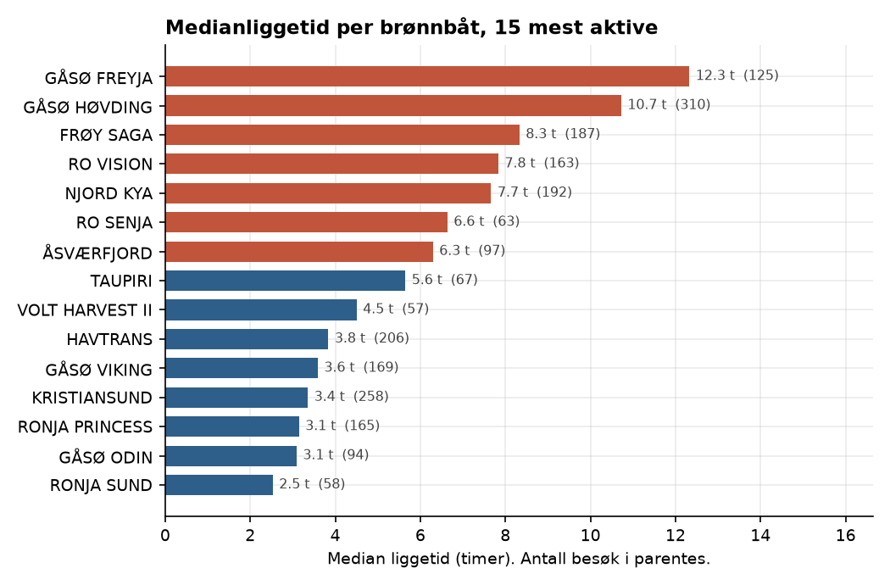
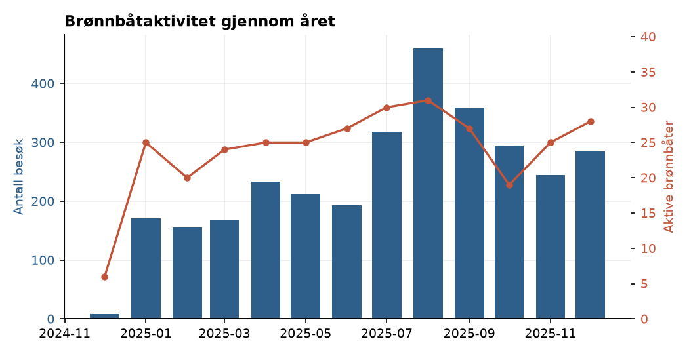

# Brønnbåtlogistikk på Nordmøre

> **Status:** under arbeid. Analysen kjører foreløpig på syntetiske testdata.
> 

Kartlegging av hvordan brønnbåtflåten opererer langs Nordmøre, basert utelukkende
på åpne data. Målet er å beskrive liggetid ved lokalitet, seilingsmønster og
kapasitetsutnyttelse på flåtenivå.

---

## Hovedfunn


1. …
2. …
3. …

## Figurer







---

## Datakilder

| Kilde | Hva | Lisens |
|---|---|---|
| Kystverket / Kystdatahuset | Historiske AIS-data (skipsbevegelser, anløp) | NLOD |
| BarentsWatch Fiskehelse API | Lokaliteter, lusetall, fartøysspor | NLOD |
| Fiskeridirektoratet, Akvakulturregisteret | Lokalitetsregister, tillatelser | NLOD |
| Sjøfartsdirektoratet, Skipsregisteret | Fartøyskategori (brønnfartøy) | — |

Inneholder data under Norsk lisens for åpne data (NLOD), tilgjengeliggjort av
Kystverket og BarentsWatch.

## Metode

Et lokalitetsbesøk defineres som at fartøyet er innenfor **400 meter** fra
lokalitetens midtpunkt med fart under **1 knop**. Dette følger BarentsWatch sin
egen definisjon, valgt for at resultatene skal være sammenlignbare med
etablert praksis.

I tillegg krever jeg minst **30 minutters** varighet, for å skille reelle
operasjoner fra passeringer og ankring i nærheten. Sammenhengende posisjoner
brytes til et nytt besøk hvis AIS-dekningen har hull på over **60 minutter**.

Parametrene ligger som konstanter øverst i `src/visits.py`.

## Begrensninger


- **AIS-data kan være mangelfulle eller feil**, særlig i områder med dårlig
  dekning. BarentsWatch tar selv dette forbeholdet.
- **AIS forteller hvor et fartøy er, ikke hva det gjør.** Jeg kan ikke se om
  båten har last om bord, hvilken operasjon som utføres, eller om et opphold
  skyldes venting, verksted eller vær.
- **«Tid mellom besøk» er ikke det samme som seilingstid.** Perioden kan
  inneholde havneopphold, lossing ved slakteri, bunkring eller venting. Å
  skille disse krever at havneposisjoner legges inn i analysen.
- **Utnyttelsesgrad er en operasjonell proxy, ikke et lønnsomhetsmål.** Lang
  liggetid ved lokalitet kan like gjerne bety ineffektivitet som høy aktivitet.
- Analysen er gjort på **flåtenivå**, ikke for å vurdere enkeltrederier.

## Kjøre prosjektet

Krever en klient fra BarentsWatch. Registrer den på `barentswatch.no` under
Min side → API-tilgang, kopier `.env.example` til `.env` og fyll inn
`BARENTSWATCH_CLIENT_ID` og `BARENTSWATCH_CLIENT_SECRET`.

```bash
pip install -r requirements.txt
python src/barentswatch.py       # sjekker at autentiseringen virker
```

Deretter i denne rekkefølgen. Alle nedlastinger caches til disk, så de kan
trygt avbrytes og startes på nytt.

```bash
python src/hent_lokaliteter.py    # lokalitetsregister for Nordmøre  (~2 min)
python src/hent_fartoysbesok.py   # fartøysbesøk per lokalitet       (~2 min)
python src/bygg_besok.py          # strukturerer besøkene
python src/hent_spor.py           # fartøysspor for hele flåten     (~50 min)
python src/bygg_waypoints.py      # lokalitetsnavn og besøkstyper
python src/rydd_waypoints.py      # slår sammen og deduplikerer
python src/analyse_hale.py        # hovedanalysen
python src/figurer.py             # figurene til denne fila
```

Uten API-tilgang kan pipelinen fortsatt testes:

```bash
python src/demo.py                # hele kjeden på syntetiske data
python -m pytest tests/ -v        # verifiserer besøksdeteksjonen
```

## Struktur

**Nedlasting**
```
src/barentswatch.py       API-klient med OAuth-håndtering
src/hent_lokaliteter.py   Lokalitetsregister, geografisk avgrenset
src/hent_fartoysbesok.py  Fartøysbesøk per lokalitet og år
src/hent_spor.py          Fartøysspor per brønnbåt og uke (kan ta opp mot 50 minutter og laste)
src/utforsk_slakteri.py   Engangsskript for å undersøke datastrukturer
```

**Bearbeiding**
```
src/bygg_besok.py         Pakker ut besøk, deduplikerer, filtrerer brønnbåter
src/bygg_waypoints.py     Henter navn og besøkstyper fra sporene
src/bygg_slakterier.py    Slakteriregister fra GeoJSON
src/rydd_waypoints.py     Slår sammen besøk over ukegrenser, fjerner dubletter
src/sjekk_spor.py         Diagnostikk av hva sporene faktisk inneholder
```

**Analyse**
```
src/visits.py             Egen besøksdeteksjon fra rå AIS-posisjoner
src/metrics.py            Nøkkeltall per fartøy, lokalitet og måned
src/analyse_hale.py       Fordeling av liggetid og regional tilknytning
src/figurer.py            Figurene i denne fila
src/demo.py               Kjørbar demo på syntetiske data
tests/                    Tester av besøkslogikken mot kjente tilfeller
```

**Data**
```
data/raw/                 Cachede API-svar (ikke i git — hentes med skript)
data/processed/           Aggregerte resultater (ikke i git — reproduseres)
```


Innspill og korrigeringer fra folk i bransjen mottas veldig gjerne — særlig på
hvor metoden bommer i forhold til hvordan dette faktisk fungerer i praksis.
