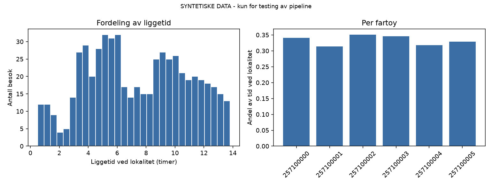

# Brønnbåtlogistikk på Nordmøre

> **Status:** under arbeid. Analysen kjører foreløpig på syntetiske testdata.
> Bytt ut denne linjen når du har ekte AIS-data inne.

Kartlegging av hvordan brønnbåtflåten opererer langs Nordmøre, basert utelukkende
på åpne data. Målet er å beskrive liggetid ved lokalitet, seilingsmønster og
kapasitetsutnyttelse på flåtenivå.

---

## Hovedfunn


1. …
2. …
3. …

## Figurer




---

## Datakilder

| Kilde | Hva | Lisens |
|---|---|---|
| Kystverket / Kystdatahuset | Historiske AIS-data (skipsbevegelser, anløp) | NLOD |
| BarentsWatch Fiskehelse API | Lokaliteter, lusetall, fartøysspor | NLOD |
| Fiskeridirektoratet, Akvakulturregisteret | Lokalitetsregister, tillatelser | NLOD |
| Sjøfartsdirektoratet, Skipsregisteret | Fartøyskategori (brønnfartøy) | — |

Inneholder data under Norsk lisens for åpne data (NLOD), tilgjengeliggjort av
Kystverket og BarentsWatch.

## Metode

Et lokalitetsbesøk defineres som at fartøyet er innenfor **400 meter** fra
lokalitetens midtpunkt med fart under **1 knop**. Dette følger BarentsWatch sin
egen definisjon, valgt for at resultatene skal være sammenlignbare med
etablert praksis.

I tillegg krever jeg minst **30 minutters** varighet, for å skille reelle
operasjoner fra passeringer og ankring i nærheten. Sammenhengende posisjoner
brytes til et nytt besøk hvis AIS-dekningen har hull på over **60 minutter**.

Parametrene ligger som konstanter øverst i `src/visits.py`.

## Begrensninger


- **AIS-data kan være mangelfulle eller feil**, særlig i områder med dårlig
  dekning. BarentsWatch tar selv dette forbeholdet.
- **AIS forteller hvor et fartøy er, ikke hva det gjør.** Jeg kan ikke se om
  båten har last om bord, hvilken operasjon som utføres, eller om et opphold
  skyldes venting, verksted eller vær.
- **«Tid mellom besøk» er ikke det samme som seilingstid.** Perioden kan
  inneholde havneopphold, lossing ved slakteri, bunkring eller venting. Å
  skille disse krever at havneposisjoner legges inn i analysen.
- **Utnyttelsesgrad er en operasjonell proxy, ikke et lønnsomhetsmål.** Lang
  liggetid ved lokalitet kan like gjerne bety ineffektivitet som høy aktivitet.
- Analysen er gjort på **flåtenivå**, ikke for å vurdere enkeltrederier.

## Kjøre prosjektet

```bash
pip install -r requirements.txt
python src/demo.py          # kjører hele pipelinen på syntetiske data
python -m pytest tests/ -v  # verifiserer besøksdeteksjonen
```

## Struktur

```
src/visits.py     Deteksjon av lokalitetsbesøk og seilaser fra AIS
src/metrics.py    Nøkkeltall per fartøy, lokalitet og måned
src/demo.py       Kjørbar demo på syntetiske data
tests/            Tester av besøkslogikken mot kjente tilfeller
data/raw/         Rådata (ikke i git — hentes med skript)
data/processed/   Aggregerte resultater
```


Høgskolen i Molde, Campus Kristiansund.

Innspill og korrigeringer fra folk i bransjen mottas veldig gjerne — særlig på
hvor metoden bommer i forhold til hvordan dette faktisk fungerer i praksis.
